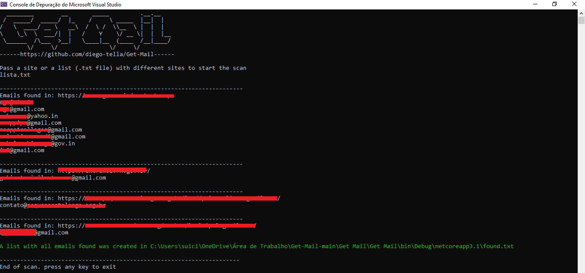

# Get-Mail
A simple C# program that gets all the emails found in a web application.

# Infos
Regex:
```
[a-z0-9!#$%&'*+/=?^_`{|}~-]+(?:\.[a-z0-9!#$%&'*+/=?^_`{|}~-]+)*@(?:[a-z0-9](?:[a-z0-9-]*[a-z0-9])?\.)+[a-z0-9](?:[a-z0-9-]*[a-z0-9])?
```
You can pass a list in a text file with different sites you want to search for emails or you can just put a URL to search for emails.

Example (censored found emails and domains):

Passing a list:


Passing a URL alone:

